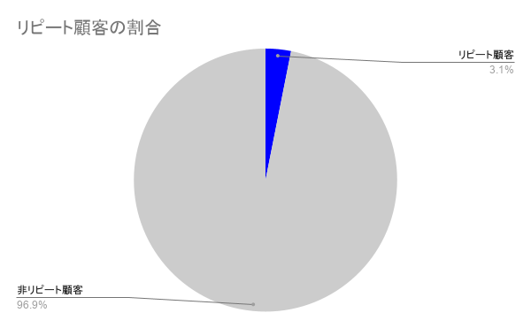
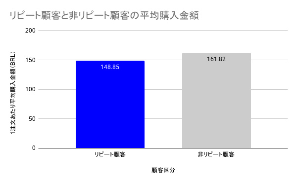
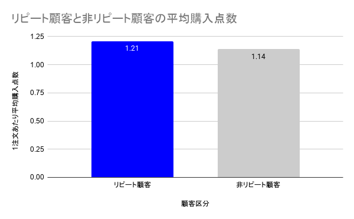

# Olist リピート顧客分析
OlistのEC購買データを用いたリピート顧客分析・売上向上施策の提案

## 分析概要
ブラジルのECサイトOlistの商品購入データを用いて、リピート顧客と非リピート顧客の購買行動を比較し、売上向上につながる施策の提案を目的とした分析を行った。

## 使用技術
- SQL
- PostgreSQL
- DBeaver
- Excel for the web

## 使用データ
Olist Brazilian E-Commerce Public Dataset

データ出典：[Kaggle - Brazilian E-Commerce Public Dataset by Olist](https://www.kaggle.com/datasets/olistbr/brazilian-ecommerce/data)

分析では以下の5つのデータを使用した。
- 顧客データ（olist_customers_dataset）
- 注文データ（olist_orders_dataset）
- 注文明細データ（olist_order_items_dataset）
- 支払データ（olist_order_payments_dataset）
- 商品データ（olist_products_dataset）

## 分析内容

### 1. リピート率の分析
全顧客のうち、リピート顧客がどの程度存在するかを分析した。

### 2. 1注文あたり平均購入金額の比較
リピート顧客と非リピート顧客で、1注文あたり平均購入金額に違いがあるかを比較した。

### 3. 1注文あたり平均購入点数の比較
リピート顧客と非リピート顧客で、1注文あたり平均購入点数に違いがあるかを比較した。

## 分析結果

### 1. リピート率
全顧客96,096人のうちリピート顧客は2,997人で、リピート率は3.12%にとどまった。

[使用SQLを見る](sql/01_repeat_rate.sql)

### 2. 1注文あたり平均購入金額
リピート顧客の1注文あたり平均購入金額は148.85 BRLで、非リピート顧客の161.82 BRLと比較して約8.0%低かった。

[使用SQLを見る](sql/02_average_order_value.sql)

### 3. 1注文あたり平均購入点数
リピート顧客の1注文あたり平均購入点数は1.21点で、非リピート顧客の1.14点より0.07点多かったが、大きな差は確認されなかった。

[使用SQLを見る](sql/03_average_items_per_order.sql)

## 施策提案・効果検証

### 施策1：リピート率の改善
初回購入者に対して、次回購入時に利用できるクーポンを配布し、再購入を促す。

**効果検証**  
初回購入者をクーポン配布群と非配布群に分けてA/Bテストを行い、リピート率を比較する。

### 施策2：平均購入金額の改善
全顧客を対象に「2点以上購入で割引」を実施し、1注文あたり平均購入金額への効果を検証する。

**効果検証**  
「2点以上購入で割引」ありと割引なしに分けてA/Bテストを行い、1注文あたり平均購入金額を比較する。

## 分析上の留意点

本分析は過去の購買データを用いた分析であり、提案した施策による効果を直接検証したものではない。

そのため、実際に施策を実施する際にはA/Bテストを行い、リピート率や1注文あたり平均購入金額への効果を検証する必要がある。
